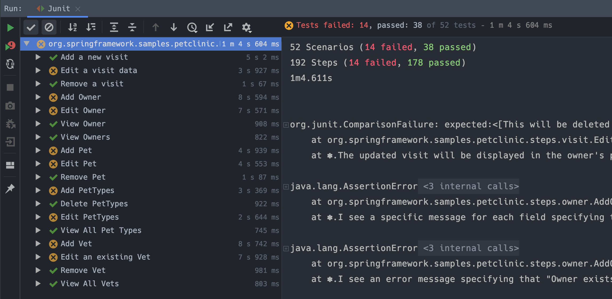
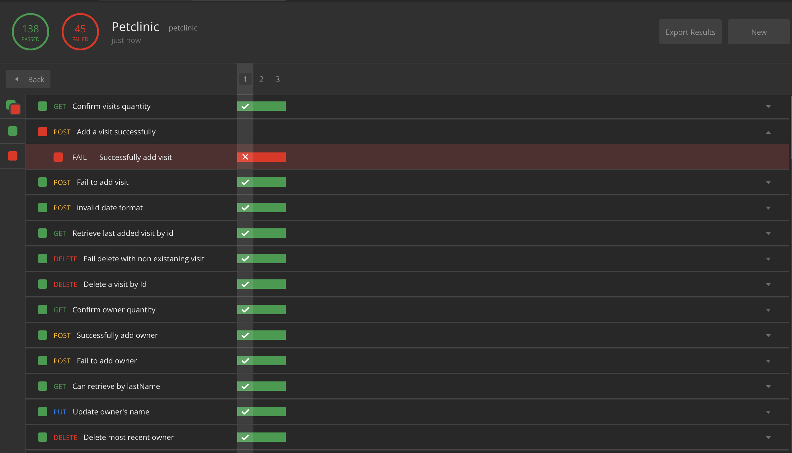
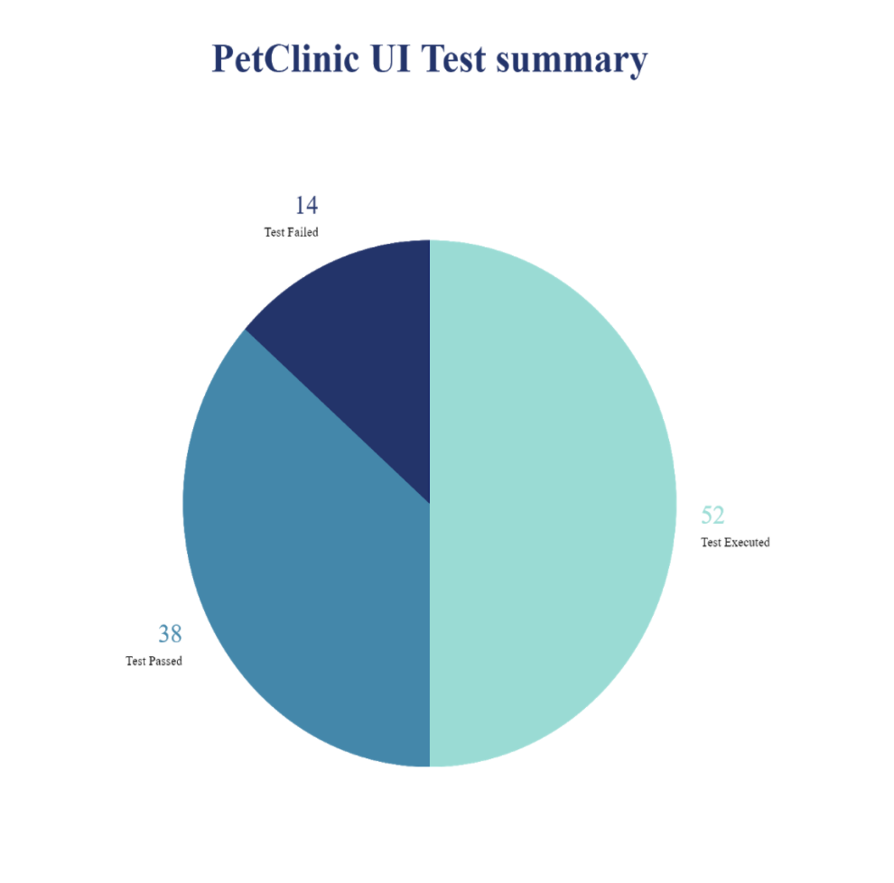
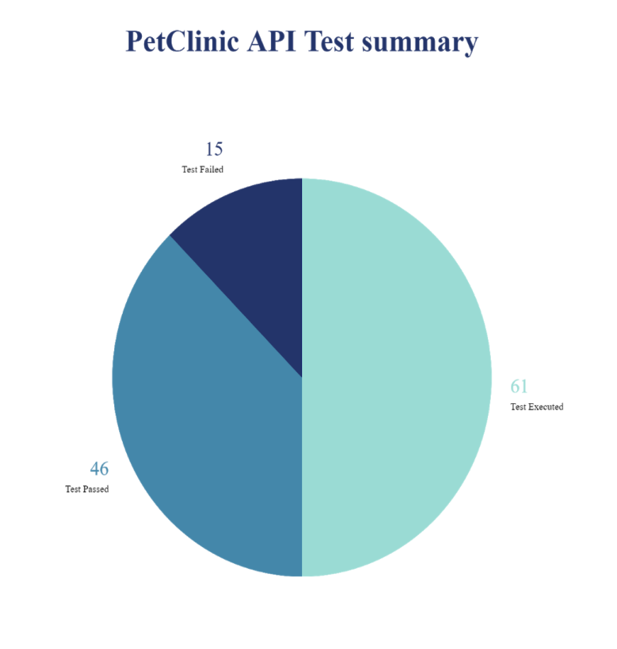

# Petclinic Automation Testing project

## Description

A very simple Full-Stack Web Application for managing a pet clinc. It demonestrates the full crud (Create , Read , Update , Delete) operations. The user can perform those operations either by using the UI (Angular based) or the API (SpringBoot based).

---

## Testing-Team (Team Gamma)

- [Abdullah Alshehri](https://github.com/abdullah-cs)
- [Ghadeer Alharbi](https://github.com/Ghadeer-bnh)
- [Hisham Bin Seddeq](https://github.com/HishamBS)
- [Mohammed Aldawsari](https://github.com/m7md21999)
- [Yahya Wehashi](https://github.com/yahya07)

---

## Technologies Used

```diff
- Java
- SpringBoot
- Angular
- Maven
- Git
- Selenium
- Cucumber
- Docker

```

## Tools Used

```diff
+ IntelliJ Idea
+ GitBash
+ Postman
```

---

## Planning and Testing Process
- After we had a discussion , we chose black box techniques (error guessing and exploratory) as our testing method to get an idea on the application before writing our test cases, since we didn't have any access to the code.
- Using the BDD (Behavioural Driven Design) , we moved onto writing the feature files and scenarios.
- Then started deviding features between the team members.
- Each team member started working on his individual feature.
- We shared and helped each other.
- We concluded with writing the test summary report.

## Problem-Solving Strategy

- lots and lots of **googling** and reading official **documentation**.
- Using the refrences supplied to us by our instructor.

---

## Test Summary Screenshots



---

## Test Summary Diagrams
 


---

## References 

All Docker Images that we used to test the web application , can be found in this link.

[Pet Clinic Docker Images](https://github.com/BryanDollery/petclinic)


--- 


## Acknowledgments

- Saudi Information Technology Company (**SITE**)
- Our Awsome Instructor : [Bryan Dollery](https://github.com/BryanDollery)
- KnowledgeHut
